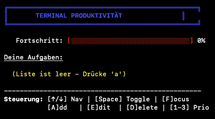

# Task-App für das Terminal auf MacOS #


## Features
- Erstellen neuer Aufgaben
- Speichern der Tasks in einer JSON-Datei
- Übersichtliche Konsolenausgabe
- Timer integriert für Konzentriertes Arbeiten (Fokusmodus)
- Funktion für den Export zum Kalender hinzugefügt
- Man kann jetzt mehrere Listen gleichzeitig haben (für unterschiedliche Arbeitsumgebungen)
  -> (Modus für Listen Steuerung wird noch verbessert)

## Installation und Ausführung
1. Stelle sicher, dass **Python** installiert ist.
2. Klone das Repository:
   ```bash
   git clone "https://github.com/Laurenssssss/task-app.git"
