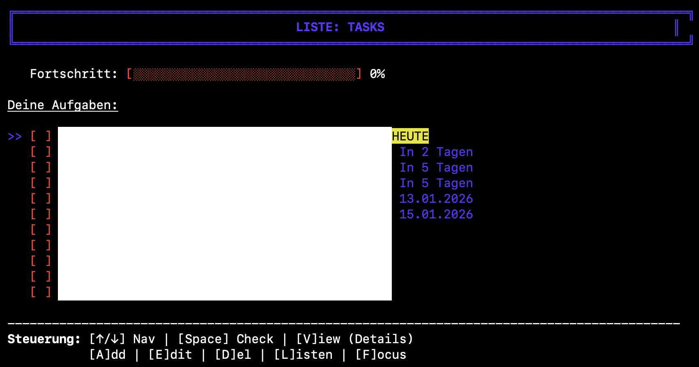
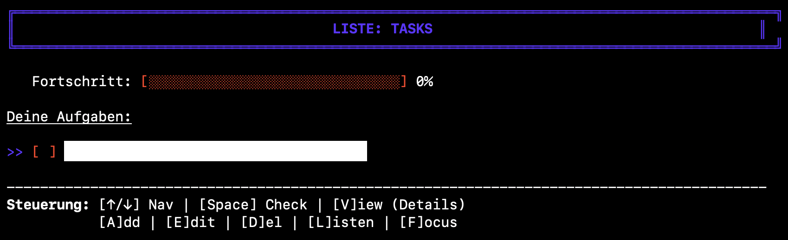
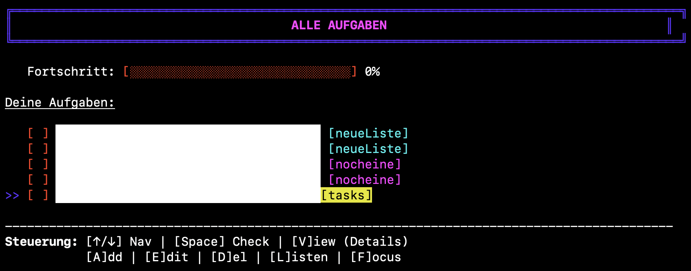

# Task-App für das Terminal auf MacOS

## Screenshots der Anwendung

<p align="center">
  
  
</p>

<p align="center">
  
  
</p>

## Features
- Erstellen neuer Aufgaben
- Speichern der Tasks in einer JSON-Datei
- Übersichtliche Konsolenausgabe
- Timer integriert für Konzentriertes Arbeiten (Fokusmodus)
- Funktion für den Export zum Kalender hinzugefügt
- Man kann mehrere Listen erstellen und sich alle Aufgaben gleichzeitig ansehen
- Aufgaben können für einen bestimmtes Datum geplant werden
- Es können Aufgaben mit Wiederholung erstellt werden
- Man kann jetzt bei der Erstellung, von sich zu wiederholenden Aufgaben, ein Enddatum festlegen

## Bugfixxes
### Listen
- Navigation ist jetzt natürlicher
- Werden in seperaten Dateien mit NAME.json gespeichert

### Anzeige
- Fehler, dass die Task nicht komplett angezeigt wurde ist repariert
- View-Mode für Details zu einer Aufgabe wurde eingeführt
- Listen werden jetzt Farblich in "Alle Tasks" - Modus angezeigt
- UI-fix
- Beim Starten sieht man jetzt Standartmäßig alle Aufgaben von allen Listen
- Die Anzeige der Abgearbeiteten Aufgaben wurde übersichtlicher gestaltet
- Man kann nun die Liste einstellen, welche beim Starten geöffnet wird (Anpassbar)

## Installation und Ausführung
1. Stelle sicher, dass **Python** installiert ist.
2. Klone das Repository:
   ```bash
   git clone "https://github.com/Laurenssssss/task-app.git"
   ```

## Future
- Besser Ansicht für zukünftige Tasks
- Abgehakte Aufgaben besser darstellen
- Uhrzeit für Aufgaben hinzufügen
